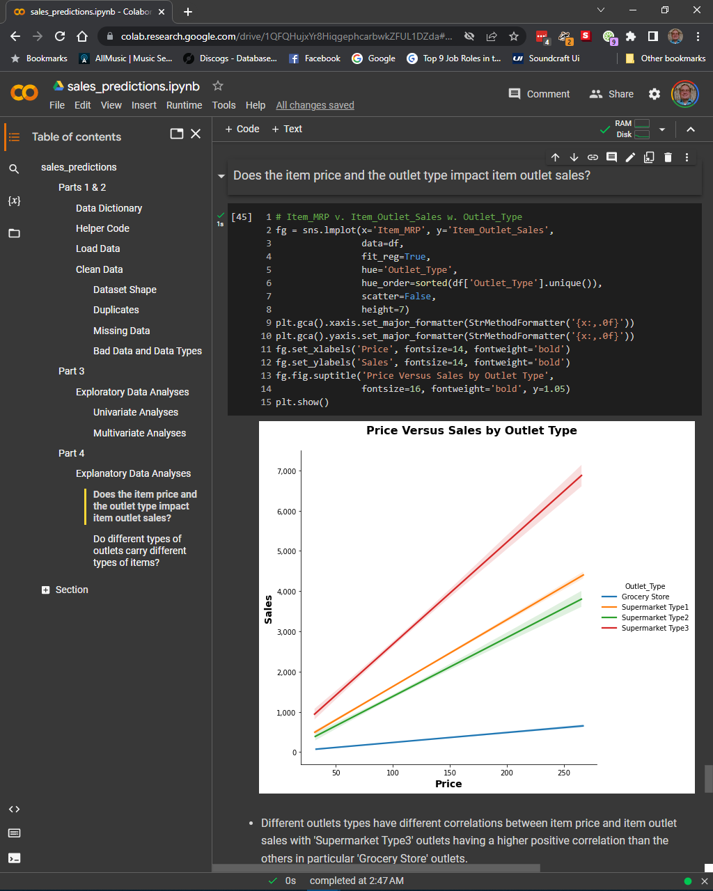

# sales_predictions

Olen Sluder

*A portfolio project demonstrating sales predictions for items sold at various retail outlets. The goal is to help the retailer understand the properties of items and outlets that play crucial roles in increasing sales.*

