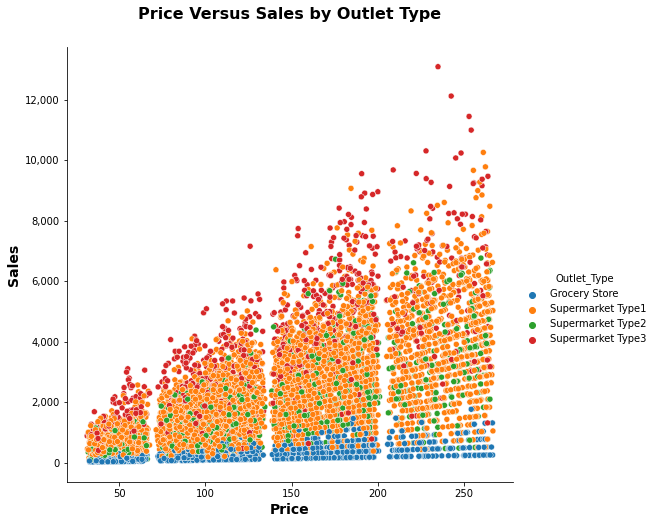

# food-sales-predictions

*Coding Dojo::Data Science::Project 1 (Core)*

Olen Sluder

*A portfolio project demonstrating sales prediction for food items sold at various stores. The goal is to help the retailer understand the properties of products and outlets that play crucial roles in increasing sales.*

