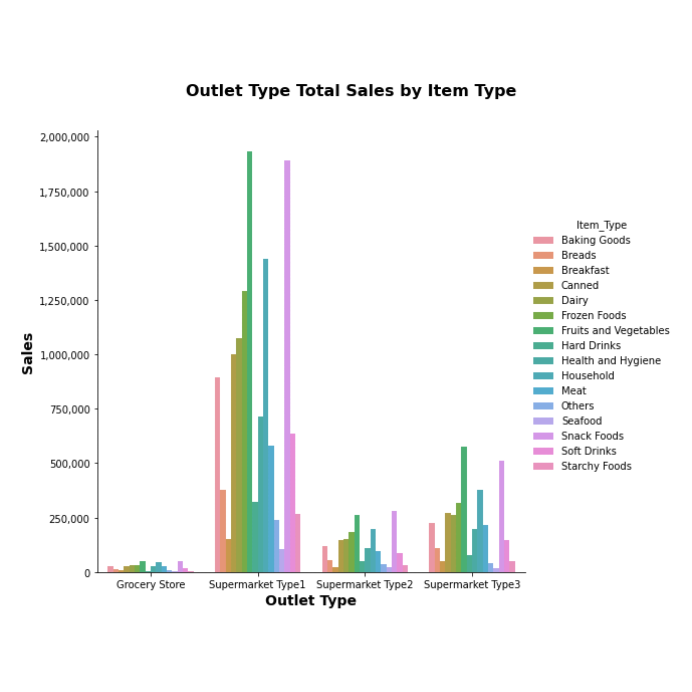

# sales_predictions

## A portfolio project demonstrating sales predictions for items sold at various retail outlets.

### Business problem:
The goal is to help the retailer understand the properties of items and outlets that play roles in increasing sales.

**Author**: Olen Sluder

### Data
The dataset consists of 8,523 rows of item and outlet data.

| Column Name | Type | Description |
|-|-|-|
| Item_Identifier | String | Unique product ID |
| Item_Weight | Float | Weight of product |
| Item_Fat_Content | String | Whether the product is low fat or regular |
| Item_Visibility | Float | The percentage of total display area of all products in a store allocated to the particular product |
| Item_Type | String | The category to which the product belongs |
| Item_MRP | Float | Maximum Retail Price (list price) of the product
| Outlet_Identifier | String | Unique store ID |
| Outlet_Establishment_Year | Integer | The year in which store was established |
| Outlet_Size | String | The size of the store in terms of ground area covered |
| Outlet_Location_Type | String | The type of area in which the store is located |
| Outlet_Type | String | Whether the outlet is a grocery store or some sort of supermarket |
| Item_Outlet_Sales | Float | Sales of the product in the particular store |

## Methods
- Missing numeric data is imputed using the mean value. 
- Missing categorical data is imputed using the most frequent value.
- Grocery store type outlets with missing size are set to 'Small'.

## Results

### Does the item price and the outlet type impact sales?

- In addition to varying between outlet types, the correlation between item price and item outlet sales is not linear: there are items with high prices that do not sell well and items with low prices that sell well.
- The retailer may want to adjust the prices of certain items to increase their sales or promote higher-priced items with a strong sales record. They could also investigate why certain items with high prices are not selling well.

### Do different types of outlets carry different types of items?

- The types of items sold varies across outlet types. In 'Supermarket Type1' outlets, the top-selling item types are 'Fruits and Vegetables', 'Snack Foods', and 'Household'. Other supermarket outlet types follow a similar pattern, but with lower total sales. In 'Grocery Store' outlets, the top-selling item types are 'Snack Foods', 'Fruits and Vegetables', and 'Household'.
- The retailer may want to promote the top-selling items in each outlet type to increase sales.

## Model

A decision tree was selected for the machine learning model. It shows the ability to predict sales on a testing dataset to within an average of 1,057.43.

### For further information

Please contact olen.sluder@gmail.com
